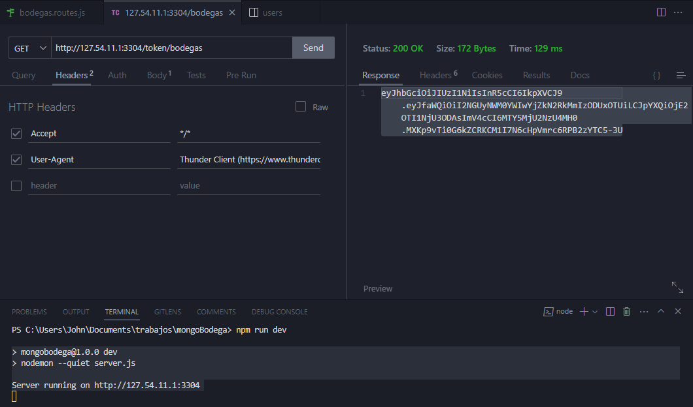
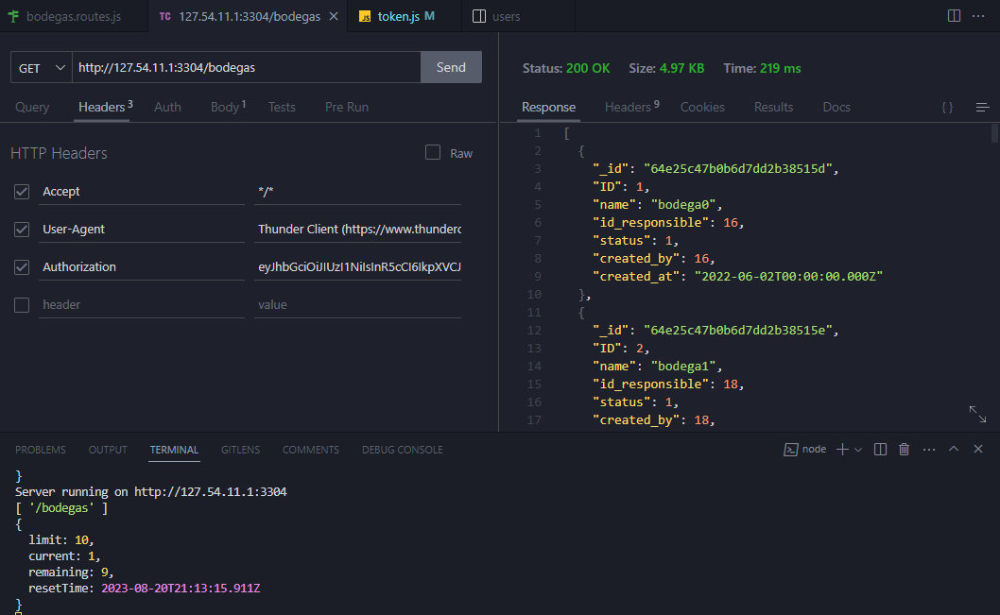

# mongoBodegas

#### Instalaciones previas

Para ejecutar correctamente este proyecto es necesario:

- **NodeJS** (se recomienda usar la versión `18.16.1`)
- **Mongodb**
- **GIT**

**Extensiones de VS para probar el proyecto **

- mongoDB
- Thunder Client

Luego de asegurarse de cumplir con los requisitos anteriores, clone el repositorio remoto a su computador local utilizando el comando:

```bash
https://github.com/Jhoukx/mongoBodega.git
```

Después de **clonar el repositorio** y tener acceso a todos los archivos es necesario que instale las dependencias usadas en el proyecto, para ello ejecute el siguiente comando en la terminal:

```bash
npm i -E -D
```

Seguido de descargar las dependencias utilizadas en el proyecto se debe clonar la base de datos de mongoDB utilizada en el proyecto **Debe tener una base de datos propia para clonar la base de datos y crear un usuario root que tenga acceso admin**, luego, debe dirigirse a la carpeta `config/db` en esta ruta encontrara dos archivos uno sobre el esquema utilizado y otro con los inserts, debe correr primero el `esquema.mongodb` y luego el `inserts.mongodb`.

Después de ejecutar los scripts de la base de datos debe crear un archivo `.env` tomando como referencia el archivo `.env.example`  y modificar los valores, tome como referencia el siguiente ejemplo:

```json
SERVER={"host":"127.54.11.1", "port":"3304"}
ATLAS_PASSWORD="campus123"
ATLAS_DB="db_mongo_bodegas"
JWT_PASSWORD="C@ampus9_92"
```

Para terminar con la instalación previa corra el servidor escribiendo en la terminal el siguiente comando:

```bash
npm run dev
```

Debe aparecer en la terminal el siguiente mensaje:
```bash
> mongobodega@1.0.0 dev
> nodemon --quiet server.js

Server running on http://127.54.11.1:3304
```

### Creación del token

Es importante saber que el token es necesario enviarlo en el header y en cada petición que se desee hacer sin importar el tipo. Para la creación del token es necesario la siguiente estructura:
```http
http://127.54.11.1:3304/token/<coleccion>
```

A continuación se muestra el resultado esperado del mismo, para la creación del token para bodegas:



## Peticiones

Para las peticiones hay un limite este se mostrara en la consola y dirá la cantidad de peticiones restantes y las que lleva en aquel momento. El array que se muestra de primero es el permiso de endpoints al que tiene acceso.

### /bodegas

Para el método GET del endpoint bodegas se debe hacer de esta manera y el resultado será este:



